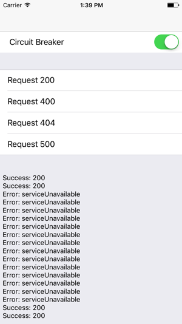

# CircuitBreakerExample

## Intro

This is an example which shows possible implementation and integration of CircuitBreaker pattern within the iOS project. Implemented according to this [specification](./spec.md).

## UI

To try this in action just clone this repository and build the project for simulator. When app will be launched you'll
see simple single-view iOS app:



You can switch between ```CircuitBreakerProvider``` and ```BaseResourceProvider``` by using ```UISwitch``` on the top. Each row of the table view represents corresponding call to https://httpbin.org/status/ where number means the status which will be sent. The bottom part will show the simple log for each call.
